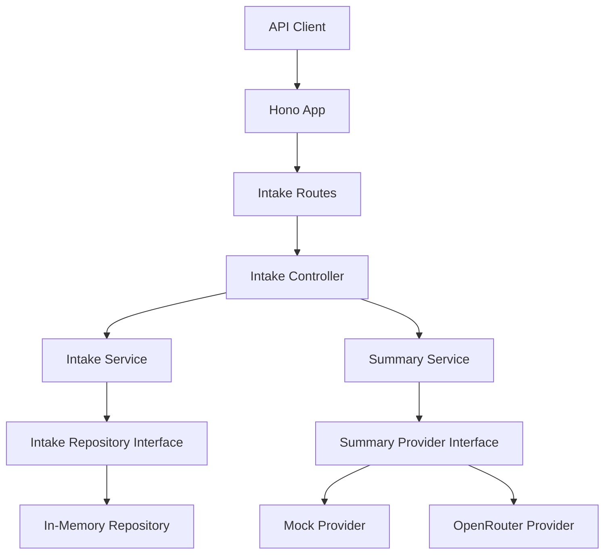
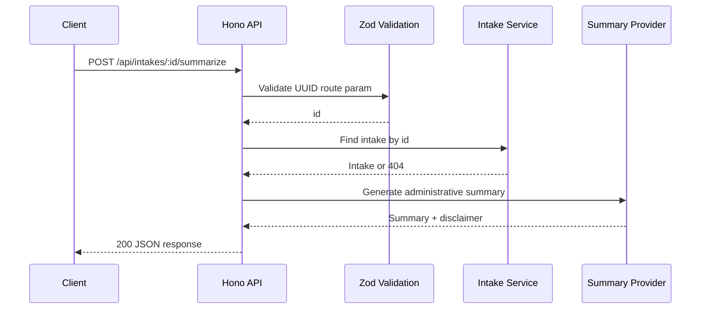

# CareFlow AI API

CareFlow AI API is a production-style backend portfolio demonstration for AI-assisted patient-intake summarization. It is built for a Senior Developer / Founding Engineer evaluation and emphasizes clear API design, replaceable infrastructure seams, validation, medical-safety constraints, and test coverage.

This project is not a diagnostic medical system. It only produces administrative intake-support summaries to help staff review information before appropriate human clinical review.

## Business Problem

Health and human-services teams often receive patient intake information as unstructured notes, symptom lists, allergy details, and medication context. Staff need a fast way to organize that information without turning an AI model into a clinician. CareFlow AI API demonstrates a backend approach where AI can reduce administrative review time while preserving explicit medical-safety boundaries.

## Features

- REST API for creating, listing, retrieving, and summarizing patient intakes
- Zod validation for request bodies, route IDs, and environment variables
- In-memory repository with an interface designed for a future PostgreSQL implementation
- Deterministic mock AI provider when no OpenRouter API key is configured
- OpenRouter provider path for Anthropic/OpenRouter-compatible summarization
- Consistent JSON error responses
- UUID identifiers and ISO timestamps
- Bun test suite covering success, validation, not-found, JSON, and medical-disclaimer behavior
- Dockerfile for containerized local execution

## Technology Stack

| Area       | Choice                            |
| ---------- | --------------------------------- |
| Runtime    | Bun                               |
| Language   | TypeScript                        |
| Framework  | Hono                              |
| Validation | Zod                               |
| AI         | OpenRouter with local mock        |
| Tests      | Bun test                          |
| Packaging  | Docker                            |
| Storage    | In-memory repository, replaceable |

## Architecture

The code is organized by feature. The API layer depends on services, services depend on interfaces, and runtime composition wires the concrete repository and AI provider in `src/app.ts`.



### Request Flow



## Project Structure

```text
src/
  app.ts                         # Runtime composition and global HTTP handling
  server.ts                      # Bun server entrypoint
  config/
    env.ts                       # Environment validation
  shared/
    errors.ts                    # AppError and error response mapping
    request.ts                   # JSON and route-param parsing helpers
  features/
    ai/
      domain/summary.ts
      providers/summary.provider.ts
      services/summary.service.ts
    intakes/
      controllers/intake.controller.ts
      domain/intake.ts
      repositories/intake.repository.ts
      routes/intake.routes.ts
      schemas/intake.schema.ts
      services/intake.service.ts
tests/
  intakes.test.ts
```

## API Endpoints

| Method | Path                         | Purpose                         | Success |
| ------ | ---------------------------- | ------------------------------- | ------- |
| GET    | `/api/health`                | Service health check            | 200     |
| POST   | `/api/intakes`               | Create an intake                | 201     |
| GET    | `/api/intakes`               | List all intakes                | 200     |
| GET    | `/api/intakes/:id`           | Retrieve one intake by UUID     | 200     |
| POST   | `/api/intakes/:id/summarize` | Generate intake-support summary | 200     |

Errors use this shape:

```json
{
  "error": {
    "code": "VALIDATION_ERROR",
    "message": "Request validation failed.",
    "details": {}
  }
}
```

Server-side provider failures return generic 5xx messages and do not expose API keys, environment variables, raw model payloads, or patient data in error details.

## Example Request

```bash
curl -X POST http://localhost:3000/api/intakes \
  -H "Content-Type: application/json" \
  -d '{
    "patientName": "Jordan Lee",
    "age": 42,
    "symptoms": ["cough", "fatigue"],
    "symptomDurationDays": 5,
    "medications": ["lisinopril"],
    "allergies": ["penicillin"],
    "additionalNotes": "Symptoms worsen at night."
  }'
```

Example create response:

```json
{
  "data": {
    "patientName": "Jordan Lee",
    "age": 42,
    "symptoms": ["cough", "fatigue"],
    "symptomDurationDays": 5,
    "medications": ["lisinopril"],
    "allergies": ["penicillin"],
    "additionalNotes": "Symptoms worsen at night.",
    "id": "00000000-0000-4000-8000-000000000000",
    "createdAt": "2026-07-29T14:15:04.090Z",
    "updatedAt": "2026-07-29T14:15:04.090Z"
  }
}
```

Summarize an intake:

```bash
curl -X POST http://localhost:3000/api/intakes/{id}/summarize
```

Example summary response:

```json
{
  "data": {
    "summary": "Jordan Lee, age 42, reported cough, fatigue for 5 day(s). Notes: Symptoms worsen at night. This administrative summary is intended to help staff prepare intake context before clinical review.",
    "keyConcerns": [
      "Reported symptoms: cough, fatigue",
      "Symptom duration: 5 day(s)",
      "Medication context to verify: lisinopril",
      "Allergies to confirm: penicillin"
    ],
    "suggestedFollowUpQuestions": [
      "When did each symptom first begin, and has the pattern changed?",
      "Are there any recent medication, allergy, exposure, or care-access changes to document?",
      "Are there any safety, mobility, transportation, language, or caregiver needs for follow-up?"
    ],
    "urgency": "routine",
    "disclaimer": "This output is for administrative intake support only and is not a medical diagnosis, triage decision, or treatment recommendation."
  }
}
```

More curl examples:

```bash
curl http://localhost:3000/api/health
curl http://localhost:3000/api/intakes
curl http://localhost:3000/api/intakes/{id}
```

## Mock Provider Behavior

If `OPENROUTER_API_KEY` is empty or omitted, the API uses `MockSummaryProvider`. The mock is deterministic, needs no network access, and returns stable output for tests and local demos. It assigns `urgent` for high-concern symptom phrases such as shortness of breath, `soon` for longer symptom duration or older age, and `routine` otherwise.

The urgency value is administrative metadata for intake review. It is not medical triage.

## OpenRouter Setup

1. Create `.env` from the example file.
2. Set `OPENROUTER_API_KEY`.
3. Optionally set `OPENROUTER_MODEL`.

```bash
cp .env.example .env
```

```env
PORT=3000
OPENROUTER_API_KEY=your_openrouter_key_here
OPENROUTER_MODEL=anthropic/claude-3.5-haiku
```

`.env` and `.env.*` are ignored by git, while `.env.example` is intentionally committed.

## Local Setup

```bash
bun install
bun run dev
```

The API starts at `http://localhost:3000`.

## Tests and Checks

```bash
bun run format
bun run typecheck
bun test
```

The tests cover health checks, valid intake creation, invalid intake rejection, malformed JSON handling, listing, retrieval, missing intakes, mock summary generation, missing summary rejection, UUID route validation, and medical disclaimer presence.

## Docker

```bash
docker build -t careflow-ai-api .
docker run --rm -p 3000:3000 --env-file .env careflow-ai-api
```

## Design Decisions

- Feature folders keep intake and AI concerns easy to inspect without over-engineering the project.
- Repository and provider interfaces make PostgreSQL and alternate AI providers straightforward future replacements.
- The mock AI provider keeps the project runnable in local and CI environments without secrets.
- Zod owns external input validation at the API boundary.
- 5xx error responses avoid serializing provider internals, raw model content, environment data, or patient intake details.
- Authentication, database persistence, Kubernetes, Terraform, and deployment automation are intentionally excluded from this portfolio scope.

## Privacy and Medical-Safety Limitations

- This is a portfolio demonstration, not a production medical device or diagnostic medical system.
- The API does not diagnose, recommend treatment, or replace licensed clinical judgment.
- The in-memory repository is not durable and should not be used for real patient data.
- No authentication, authorization, audit logging, encryption-at-rest strategy, rate limiting, consent workflow, or HIPAA compliance program is implemented.
- OpenRouter mode sends intake content to an external AI provider and should only be used with appropriate agreements, consent, and privacy controls in a real deployment.

## Future Production Improvements

- PostgreSQL persistence with migrations
- Authentication and role-based authorization
- Audit logs and request correlation IDs
- Rate limiting and abuse protection
- Background jobs for long-running AI requests
- Observability with structured logs, metrics, and tracing
- Redaction and retention policies for sensitive intake data
- Provider retries, timeout budgets, and circuit breakers
- Infrastructure-as-code and deployment pipelines when the product scope requires them
