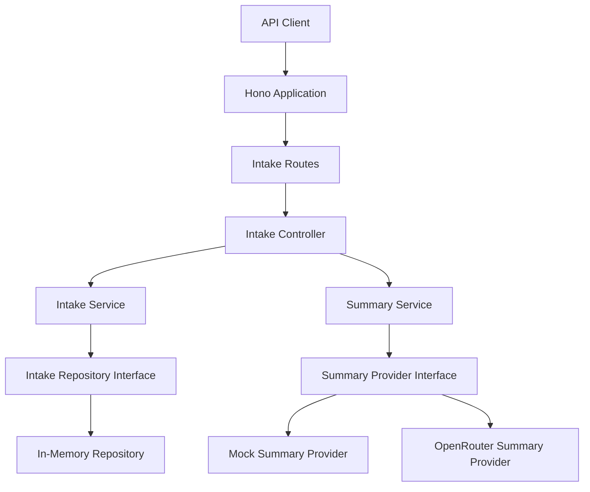
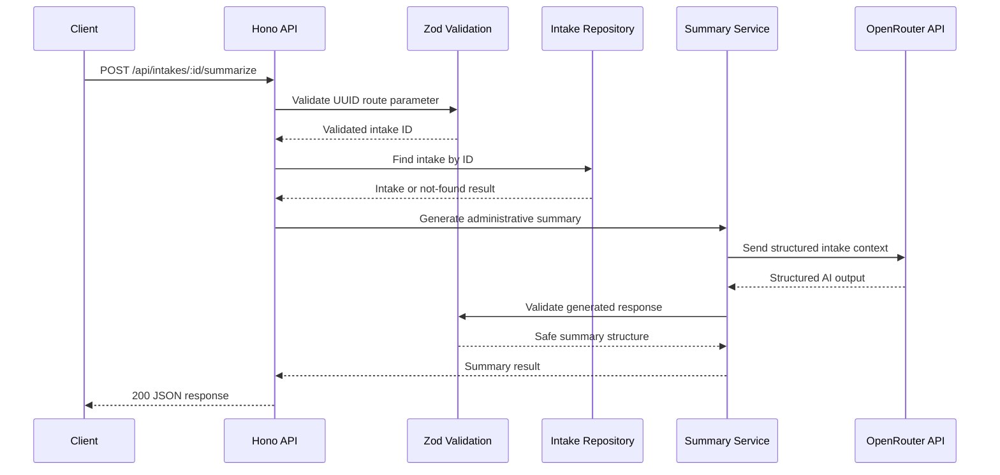
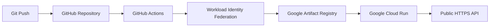

# CareFlow AI API

CareFlow AI API is a production-style backend portfolio project for AI-assisted patient-intake summarization.

It demonstrates:

* RESTful API design
* Type-safe validation
* Feature-based architecture
* Replaceable repository and AI-provider abstractions
* Structured AI responses
* Defensive error handling
* Automated testing
* Docker containerization
* Continuous deployment to Google Cloud Run
* Explicit privacy and medical-safety boundaries

The application accepts structured patient-intake information and generates an administrative summary to help staff organize the information before human clinical review.

> **Important:** This project is not a diagnostic medical system. It does not provide medical diagnoses, treatment recommendations, or clinical triage decisions.

---

## Live Deployment

The API is deployed as a containerized service on Google Cloud Run.

### Application URL

```text
https://careflow-ai-api-ok7mep3dgq-ew.a.run.app
```

### Health Check

```text
https://careflow-ai-api-ok7mep3dgq-ew.a.run.app/api/health
```

Test the health endpoint:

```bash
curl https://careflow-ai-api-ok7mep3dgq-ew.a.run.app/api/health
```

---

## Business Problem

Health and human-services teams often receive intake information as a combination of:

* Unstructured notes
* Symptom descriptions
* Medication information
* Allergy information
* Duration details
* Additional patient context

Staff must review and organize this information before the appropriate clinical workflow can continue.

CareFlow AI API demonstrates how an AI provider can assist with this administrative step without presenting the model as a clinician.

The generated response organizes the intake into:

* A concise administrative summary
* Key details for staff to verify
* Suggested follow-up questions
* Administrative urgency metadata
* A mandatory medical-use disclaimer

---

## Features

* Create patient intakes
* List all stored intakes
* Retrieve an intake by UUID
* Generate an AI-assisted intake summary
* OpenRouter integration with a configurable model
* Deterministic local mock provider when no OpenRouter API key is configured
* Zod validation for request bodies, route parameters, environment variables, and AI output
* Structured JSON responses
* Consistent application error format
* UUID identifiers
* ISO 8601 timestamps
* Feature-based architecture
* Replaceable repository abstraction
* Replaceable AI summary-provider abstraction
* Bun test suite
* Docker containerization
* Google Cloud Run deployment
* GitHub Actions deployment workflow

---

## Technology Stack

| Area                           | Technology                   |
| ------------------------------ | ---------------------------- |
| Runtime                        | Bun                          |
| Language                       | TypeScript                   |
| HTTP framework                 | Hono                         |
| Validation                     | Zod                          |
| AI provider                    | OpenRouter                   |
| Local AI fallback              | Deterministic mock provider  |
| Testing                        | Bun test                     |
| Packaging                      | Docker                       |
| Deployment                     | Google Cloud Run             |
| Container registry             | Google Artifact Registry     |
| CI/CD                          | GitHub Actions               |
| Authentication to Google Cloud | Workload Identity Federation |
| Storage                        | In-memory repository         |

---

## Architecture

The project is organized by feature.

The HTTP layer delegates business operations to services. Services depend on interfaces rather than infrastructure implementations. Runtime composition in `src/app.ts` selects and connects the concrete repository and summary provider.



### Summary Request Flow



### Deployment Flow



---

## Project Structure

```text
src/
  app.ts
  server.ts

  config/
    env.ts

  shared/
    errors.ts
    request.ts

  features/
    ai/
      domain/
        summary.ts
      providers/
        summary.provider.ts
      services/
        summary.service.ts

    intakes/
      controllers/
        intake.controller.ts
      domain/
        intake.ts
      repositories/
        intake.repository.ts
      routes/
        intake.routes.ts
      schemas/
        intake.schema.ts
      services/
        intake.service.ts

tests/
  intakes.test.ts
```

### Important Files

| File                    | Responsibility                                 |
| ----------------------- | ---------------------------------------------- |
| `src/app.ts`            | Runtime composition and global HTTP handling   |
| `src/server.ts`         | Bun server entry point                         |
| `src/config/env.ts`     | Environment-variable validation                |
| `src/shared/errors.ts`  | Application errors and error-response mapping  |
| `src/shared/request.ts` | JSON-body and route-parameter parsing          |
| `intake.controller.ts`  | HTTP request and response coordination         |
| `intake.service.ts`     | Intake business operations                     |
| `intake.repository.ts`  | Storage interface and in-memory implementation |
| `summary.service.ts`    | AI-summary orchestration                       |
| `summary.provider.ts`   | Mock and OpenRouter provider implementations   |

---

## API Endpoints

| Method | Path                         | Purpose                            | Success Status |
| ------ | ---------------------------- | ---------------------------------- | -------------: |
| `GET`  | `/api/health`                | Check service health               |          `200` |
| `POST` | `/api/intakes`               | Create an intake                   |          `201` |
| `GET`  | `/api/intakes`               | List all intakes                   |          `200` |
| `GET`  | `/api/intakes/:id`           | Retrieve one intake by UUID        |          `200` |
| `POST` | `/api/intakes/:id/summarize` | Generate an intake-support summary |          `200` |

---

## Testing the Live API

### 1. Create an Intake

```bash
curl -X POST \
  https://careflow-ai-api-ok7mep3dgq-ew.a.run.app/api/intakes \
  -H "Content-Type: application/json" \
  -d '{
    "patientName": "Jordan Lee",
    "age": 42,
    "symptoms": ["cough", "fatigue"],
    "symptomDurationDays": 5,
    "medications": ["lisinopril"],
    "allergies": ["penicillin"],
    "additionalNotes": "Symptoms worsen at night."
  }'
```

Example response from the deployed application:

```json
{
  "data": {
    "patientName": "Jordan Lee",
    "age": 42,
    "symptoms": [
      "cough",
      "fatigue"
    ],
    "symptomDurationDays": 5,
    "medications": [
      "lisinopril"
    ],
    "allergies": [
      "penicillin"
    ],
    "additionalNotes": "Symptoms worsen at night.",
    "id": "66d125a6-9b5f-4ded-b653-11046c132004",
    "createdAt": "2026-07-29T19:35:54.155Z",
    "updatedAt": "2026-07-29T19:35:54.155Z"
  }
}
```

The returned `id` identifies the newly created intake.

Because the current repository is stored in memory, IDs are not guaranteed to remain available after a Cloud Run instance restart or replacement.

---

### 2. Generate an AI Summary

Use the ID returned by the create request:

```bash
curl -X POST \
  https://careflow-ai-api-ok7mep3dgq-ew.a.run.app/api/intakes/66d125a6-9b5f-4ded-b653-11046c132004/summarize
```

Example response generated through the configured OpenRouter integration:

```json
{
  "data": {
    "summary": "Jordan Lee, age 42, reported cough, fatigue for 5 day(s). Notes: Symptoms worsen at night. This administrative summary is intended to help staff prepare intake context before clinical review.",
    "keyConcerns": [
      "Reported symptoms: cough, fatigue",
      "Symptom duration: 5 day(s)",
      "Medication context to verify: lisinopril",
      "Allergies to confirm: penicillin"
    ],
    "suggestedFollowUpQuestions": [
      "When did each symptom first begin, and has the pattern changed?",
      "Are there any recent medication, allergy, exposure, or care-access changes to document?",
      "Are there any safety, mobility, transportation, language, or caregiver needs for follow-up?"
    ],
    "urgency": "routine",
    "disclaimer": "This output is for administrative intake support only and is not a medical diagnosis, triage decision, or treatment recommendation."
  }
}
```

This successful request verifies the complete deployed flow:

1. The Cloud Run service accepted the request.
2. The application retrieved the intake from its repository.
3. The summary service sent the structured intake context through OpenRouter.
4. The AI response was returned in the required application format.
5. The response included the mandatory medical-safety disclaimer.

---

## Additional Requests

### List Intakes

```bash
curl \
  https://careflow-ai-api-ok7mep3dgq-ew.a.run.app/api/intakes
```

### Retrieve One Intake

```bash
curl \
  https://careflow-ai-api-ok7mep3dgq-ew.a.run.app/api/intakes/{id}
```

### Generate a Summary

```bash
curl -X POST \
  https://careflow-ai-api-ok7mep3dgq-ew.a.run.app/api/intakes/{id}/summarize
```

Replace `{id}` with a UUID returned by the create-intake endpoint.

---

## Response Format

Successful responses use a top-level `data` property:

```json
{
  "data": {}
}
```

Errors use a consistent error structure:

```json
{
  "error": {
    "code": "VALIDATION_ERROR",
    "message": "Request validation failed.",
    "details": {}
  }
}
```

Possible error categories include:

* Invalid request bodies
* Malformed JSON
* Invalid UUID route parameters
* Missing intakes
* Unknown routes
* AI-provider failures
* Unexpected internal failures

Server-side provider failures return generic `5xx` responses.

Error responses are designed not to expose:

* API keys
* Environment variables
* Raw provider payloads
* Internal stack traces
* Patient-intake contents
* Provider implementation details

---

## Validation

Zod is used at external trust boundaries.

Validation includes:

* Environment variables
* Intake creation bodies
* UUID route parameters
* JSON request parsing
* AI-generated summary structures

This ensures that data is validated before entering business logic and that provider responses conform to the application’s expected structure before being returned to the client.

---

## OpenRouter Integration

When `OPENROUTER_API_KEY` is configured, the application uses the OpenRouter summary provider.

The provider receives the structured intake context and is instructed to return an administrative support response containing:

* `summary`
* `keyConcerns`
* `suggestedFollowUpQuestions`
* `urgency`
* `disclaimer`

The provider abstraction prevents OpenRouter-specific logic from being coupled directly to the controller or intake service.

A different AI provider can therefore be introduced by implementing the same summary-provider interface.

### Environment Configuration

Create a local environment file:

```bash
cp .env.example .env
```

Example configuration:

```env
PORT=3000
OPENROUTER_API_KEY=your_openrouter_key_here
OPENROUTER_MODEL=your_openrouter_model_here
```

The configured model can be changed without modifying the controller or service layer.

Do not commit real API keys.

The following files should remain ignored by Git:

```text
.env
.env.*
```

The example configuration file is intentionally committed:

```text
.env.example
```

---

## Mock Provider Behavior

When `OPENROUTER_API_KEY` is empty or omitted, the application uses `MockSummaryProvider`.

The mock provider:

* Requires no network access
* Requires no external API credentials
* Produces deterministic output
* Supports local development
* Supports reliable automated tests
* Preserves the same response contract as the OpenRouter provider

The mock can assign administrative urgency metadata based on predefined conditions.

For example:

* `urgent` for configured high-concern phrases
* `soon` for selected duration or age conditions
* `routine` otherwise

The urgency field is administrative metadata for intake-review organization.

It is not a medical triage determination.

---

## Local Setup

### Requirements

* Bun
* Git

### Install Dependencies

```bash
bun install
```

### Configure the Environment

```bash
cp .env.example .env
```

Add an OpenRouter API key to use the external provider.

Leave the key empty to use the deterministic mock provider.

### Start the Development Server

```bash
bun run dev
```

The local API starts at:

```text
http://localhost:3000
```

### Local Health Check

```bash
curl http://localhost:3000/api/health
```

---

## Tests and Quality Checks

Run formatting:

```bash
bun run format
```

Run TypeScript checks:

```bash
bun run typecheck
```

Run the test suite:

```bash
bun test
```

The test suite covers behavior including:

* Health checks
* Valid intake creation
* Intake listing
* Intake retrieval
* Invalid intake rejection
* Malformed JSON handling
* Missing-intake responses
* Invalid UUID rejection
* Mock summary generation
* Missing-intake summary rejection
* Consistent error structures
* Medical-disclaimer presence

---

## Docker

### Build the Image

```bash
docker build -t careflow-ai-api .
```

### Run the Container

```bash
docker run --rm \
  -p 3000:3000 \
  --env-file .env \
  careflow-ai-api
```

The container exposes the API on port `3000` locally.

In Google Cloud Run, the application reads the platform-provided port through its environment configuration.

---

## Cloud Deployment

The application is deployed to Google Cloud Run in the `europe-west1` region.

The deployment workflow:

1. GitHub Actions authenticates to Google Cloud through Workload Identity Federation.
2. The workflow builds the application’s Docker image.
3. The image is pushed to Google Artifact Registry.
4. Google Cloud Run deploys a new service revision.
5. The application becomes available through its public HTTPS endpoint.

This demonstrates a complete path from source code to a publicly accessible containerized backend.

### Deployment Verification

```bash
curl \
  https://careflow-ai-api-ok7mep3dgq-ew.a.run.app/api/health
```

A successful response confirms that the active Cloud Run revision is reachable.

---

## Design Decisions

### Feature-Based Organization

Intake and AI-summary functionality are grouped by feature rather than by broad technical layer alone.

This keeps related controllers, services, schemas, domain types, and interfaces close together.

### Repository Abstraction

Business logic depends on an intake-repository interface rather than directly depending on the in-memory implementation.

A PostgreSQL repository can therefore be added without rewriting the controller contract.

### Provider Abstraction

The summary service depends on a provider interface rather than directly depending on OpenRouter.

This supports:

* Local mock behavior
* OpenRouter integration
* Future provider replacements
* Easier provider testing
* Reduced vendor coupling

### Runtime Composition

Concrete dependencies are assembled in `src/app.ts`.

This keeps object construction separate from business logic and makes the dependency graph easy to inspect.

### Boundary Validation

Zod validates untrusted input before it reaches the service layer.

The same principle is applied to generated provider output before it is returned to the API client.

### Safe Provider Failure Handling

Internal provider failures are translated into controlled application errors.

Raw provider responses and sensitive configuration are not serialized into public error responses.

### Deterministic Testing

The mock provider produces stable output without external API calls.

Tests therefore do not depend on:

* Network availability
* Provider rate limits
* Model availability
* API credits
* Nondeterministic text generation

---

## Privacy and Medical-Safety Limitations

This project is a portfolio demonstration, not a production medical device.

It does not implement the complete technical, legal, organizational, or clinical controls required for processing real patient information.

Current limitations include:

* In-memory, non-durable storage
* No authentication
* No role-based authorization
* No audit logging
* No encryption-at-rest strategy
* No consent workflow
* No data-retention policy
* No patient-data redaction layer
* No rate limiting
* No abuse prevention
* No formal clinical validation
* No HIPAA compliance program
* No regulated medical-device approval
* No guaranteed AI-provider data residency

The deployed public API must only be used with fictional or non-sensitive demonstration data.

OpenRouter mode sends intake content to an external AI provider. A real implementation would require appropriate privacy agreements, consent, access controls, data-processing policies, and legal review before transmitting patient information.

---

## Future Production Improvements

* PostgreSQL persistence
* Database migrations
* Authentication
* Role-based authorization
* Audit logs
* Request correlation IDs
* Rate limiting
* Abuse protection
* Structured production logging
* Metrics and distributed tracing
* Sensitive-data redaction
* Data-retention policies
* Consent management
* Provider timeout budgets
* Retry policies
* Circuit breakers
* Idempotency controls
* Background jobs for longer AI operations
* Secret-management integration
* Automated security scanning
* Infrastructure as code
* Private service configuration
* Formal medical and privacy compliance review

---

## Portfolio Scope

CareFlow AI API intentionally focuses on backend engineering fundamentals rather than attempting to imitate a complete healthcare platform.

The current implementation demonstrates:

* API contract design
* Service and repository separation
* Dependency inversion
* External-provider integration
* Runtime validation
* Error-boundary design
* Testability
* Containerization
* Cloud deployment
* CI/CD authentication and delivery

The project is production-style, but it is not presented as production-ready for real patient data.

---

## Disclaimer

CareFlow AI API is an educational and portfolio project.

Its output is for administrative intake support only and is not a medical diagnosis, triage decision, or treatment recommendation.
